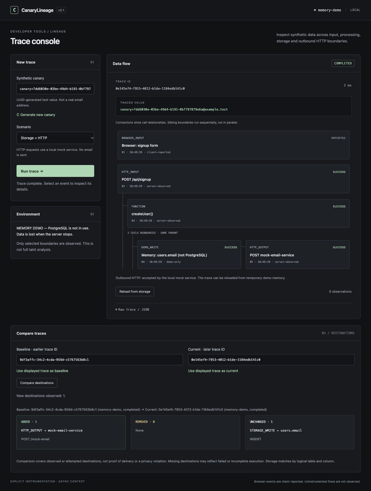

# CanaryLineage

**Runtime synthetic-data lineage for instrumented Node.js applications.**

CanaryLineage is a local developer tool that follows a controlled synthetic value through selected Express, service, PostgreSQL and outbound HTTP boundaries. It answers a practical debugging question: **which observed destinations did this test value reach, and what changed between two executions?**

Built by **Can Yılmaz**.

[Portfolio](https://can-yilmaz.netlify.app/) · [LinkedIn](https://www.linkedin.com/in/can-yilmaz-200594381) · [Architecture](docs/ARCHITECTURE.md) · [Verification record](docs/VERIFICATION.md)



*Local memory-demo: the comparison below the trace shows an added mock HTTP destination. This screenshot does not demonstrate PostgreSQL persistence.*

## v0.2.0: reusable runtime SDK (alpha)

The existing v0.1 browser demo remains compatible. The new [SDK](docs/SDK.md) supports multiple synthetic canaries in one execution, explicit transformation ancestry, overall/per-canary destination comparison, and PostgreSQL read/write observations of returned known values. It reuses the existing async context and event recorder, with a versioned schema-v2 document and separate trace-store contract.

`npm run demo:sdk` prints an explicitly illustrative SDK trace and comparison. `npm run verify:postgres` includes the real **synthetic value → SHA-256 derive → PostgreSQL INSERT → SELECT → localhost HTTP** integration. `npm run benchmark:sdk` measures an in-process microbenchmark, not production throughput.

No distributed propagation, queues, policy CLI or SDK trace UI is included in this release. The existing graphical console still uses the v0.1 demo model. The package remains private to prevent accidental npm publication; install the checkout locally as documented in [SDK.md](docs/SDK.md).

## At a glance

- **Trace a synthetic value:** preserve request context across asynchronous work with `AsyncLocalStorage` and inspect parent/child events in a dark trace console.
- **Compare destinations:** identify added, removed and unchanged storage or HTTP destinations across two saved traces, without treating timing or status changes as new destinations.
- **Inspect partial failures:** retain evidence of a successful storage write when a later HTTP call fails; distinguish pending traces from finalized ones.
- **Try it locally:** run a clearly labelled in-memory demo, or configure PostgreSQL for persistent storage.

**Stack:** JavaScript · Node.js · Express · PostgreSQL · plain HTML/CSS/JavaScript.

**Scope:** package v0.2.0 alpha; explicit instrumentation of selected boundaries. This is not whole-program discovery, full taint analysis, a privacy-compliance guarantee or production-ready security software.

For a short review, run the [demo](#quick-start), try the [destination comparison](#compare-destinations), then inspect the [architecture](docs/ARCHITECTURE.md) and [checks](#checks-and-scripts).

## Quick start

Requires **Node.js 24 LTS + npm** (minimum 22.9). Install from [nodejs.org](https://nodejs.org/en/download) if `node -v` / `npm -v` are unavailable.

```sh
git clone https://github.com/can821/CanaryLineage.git
cd CanaryLineage
npm ci
npm run demo
```

Open **http://127.0.0.1:3000**. Select a scenario, then **Run trace**:

- **Storage + HTTP:** store the synthetic email, then send it to a local mock endpoint.
- **Storage only:** no outgoing request for this trace.
- **HTTP failure:** storage succeeds; the local mock returns 503. The response is 502 with a failed trace, retaining the successful storage event.

Each run needs a new canary; use **Generate new canary**. Duplicate email returns 409. Click event cards for metadata. **Reload from storage** retrieves the saved trace. Raw JSON is expandable.

The mock service starts automatically on an ephemeral loopback port in the same Node process. It sends no email, retains no payload, and uses no third-party API. `Ctrl+C` stops both listeners. If port 3000 is occupied: `PORT=3003 npm run demo`.

**Memory-demo is not PostgreSQL.** At most 500 traces are retained, and they disappear on restart. When full, restart the demo. `npm run demo` does not load `.env`.

## How it works

```text
Browser report (client-reported)
HTTP_INPUT /api/signup
└── FUNCTION createUser()
    ├── DATABASE_WRITE users.email  [or explicitly labeled DEMO_WRITE]
    └── HTTP_OUTPUT mock-email-service
```

The storage and HTTP events share a service parent. They execute **sequentially**, not in parallel; the branch expresses their common caller. The browser report is a separate untrusted source observation.

`traceRequest()` validates the synthetic value and establishes `AsyncLocalStorage.run()`. `tracedFunction()` observes the service. Storage and HTTP helpers discover the active context without passing trace IDs through business function arguments. Only explicitly instrumented boundaries are observed.

## Compare destinations

In **Compare traces**, use two saved trace IDs. The first two saved traces populate the fields automatically; buttons let you use the currently displayed trace, and the inputs suggest traces seen in this browser session. Older stored IDs can be pasted manually.

1. Run **Storage only** and use it as baseline.
2. Generate a new canary and run **Storage + HTTP** as current.
3. Compare: `HTTP_OUTPUT → mock-email-service` is added; `users.email` is unchanged.
4. Swap IDs: the HTTP destination is removed. Two storage-only runs have no destination changes.

Storage identities use table + column + operation; `DATABASE_WRITE` and `DEMO_WRITE` share a logical `STORAGE_WRITE` identity, while the response keeps both storage modes visible. This does not equate memory with durable PostgreSQL or distinguish physical databases. HTTP identities use destination + method + logical path; ephemeral mock ports are irrelevant. The mock's deliberate failure route maps to the same logical `/mock-email` operation.

IDs, values, order, duplicate events, timestamps, duration and success/failure do not change destination identity. Failed or pending calls still represent observed attempts. Missing destinations can reflect an incomplete execution; results are neither proof of delivery nor a privacy violation. Comparison does not discover uninstrumented paths or compare graph topology.

## Real PostgreSQL setup

For one-command local verification using existing PostgreSQL binaries or an existing local test server, see [Local PostgreSQL verification](docs/POSTGRES_LOCAL.md). `npm run verify:postgres` checks a configured test server; add `-- --temporary` with `PG_BIN` to use an isolated temporary real server. No database software is installed.

Use an existing local PostgreSQL 17+ installation (for example [Postgres.app](https://postgresapp.com/) on macOS). Start it, then use its local admin account:

```sh
psql postgres
```

```sql
CREATE ROLE canary_dev LOGIN;
\password canary_dev
CREATE DATABASE canary_lineage OWNER canary_dev;
CREATE DATABASE canary_lineage_test OWNER canary_dev;
\q
```

The password command prompts without putting a real password in shell history. If `psql postgres` cannot connect, use your installation's local admin connection.

```sh
cp .env.example .env
```

Edit `.env`: replace `YOUR_USER` with `canary_dev` and `YOUR_PASSWORD` with your local password; use the correct port. Percent-encode special characters in connection URLs. Keep `.env` out of Git.

```sh
npm run db:init
npm run verify
npm run test:postgres
npm start
```

`db:init` creates tables inside an existing database; it does not create the database or erase rows. `test:postgres` requires `TEST_DATABASE_URL` pointing to a dedicated test database. It creates and removes only its own random test schema. Missing configuration fails explicitly instead of skipping.

The integration test covers actual INSERT/read, atomic rollback, duplicate races, HTTP branches, failed HTTP after successful DB write, and reading through a **fresh Node application process**. This workflow passed in normal macOS Terminal, as reported by the project owner; it was not rerun successfully inside Work. For a manual persistence check, save a trace ID, stop/restart `npm start`, then open `/api/traces/<id>`.

## Trace persistence and failures

1. User + **pending** trace are written in one PostgreSQL transaction.
2. After COMMIT, the database boundary is marked successful. HTTP runs if selected.
3. A separate UPDATE stores the completed or failed final trace.

HTTP and PostgreSQL are **not a distributed transaction**. HTTP failure does not undo a committed user. A failure/timeout does not prove the recipient never received the payload. There are no automatic retries or idempotency keys.

If finalization fails, the API returns a failure plus available evidence and `traceSaved: false`. The database may still contain a pending trace. If the process dies between steps, pending means incomplete/unknown, not success. Failures before the initial write are response-only; failures after the initial write can be retrieved if finalization succeeds. COMMIT connection loss is marked `unconfirmed`.

## Model and API

Trace: `schemaVersion`, `id`, `canary`, `storage`, `status`, `startedAt`, `finishedAt`, `events`.

Event: `id`, `parentId`, `sequence`, `type`, `location`, `value`, `occurredAt`, `evidence`, `status`, `metadata`. Types include `HTTP_INPUT`, `FUNCTION`, `DATABASE_WRITE`, `DEMO_WRITE`, `HTTP_OUTPUT`, `ERROR`, and `BROWSER_INPUT`.

| Endpoint | Purpose |
|---|---|
| `GET /api/health` | Storage readiness/mode and outbound availability |
| `POST /api/signup` | JSON `email`, optional `browserEvent`, `scenario` (`storage`, `http`, `http-failure`) |
| `GET /api/traces/:id` | Saved pending/completed/failed trace and readable tree |
| `GET /api/compare?baseline=<UUID>&current=<UUID>` | Added, removed and unchanged logical destinations |

Only `canary+<UUID v4>@example.test` is accepted. HTTP metadata records method, a fixed local destination, status, duration and a safe failure category. No authorization headers, passwords, raw response bodies or connection strings are recorded.

## Checks and scripts

```sh
npm run verify          # Syntax checks + database-independent tests
npm run test:postgres   # Real PostgreSQL integration, separate prerequisite
npm run dev            # PostgreSQL mode; restart on source changes
```

Tests exercise overlapping async requests, parent relationships, value isolation, real loopback HTTP, failure, timeout, finalization failure, SQL parameterization and rollback. The GitHub Actions workflow provisions PostgreSQL 17 and runs both groups after publication. [GitHub Actions passed on 2 October 2026](https://github.com/can821/CanaryLineage/actions/runs/36989343482), including both `npm run verify` and the real PostgreSQL integration test.

**PostgreSQL verification:** on 1 October 2026 the project owner reported a successful real `verify:postgres` run in normal macOS Terminal, including connection, schema, INSERT, HTTP, transactions and retrieval after the writer process exited. Work's sandbox could not start PostgreSQL and did not perform that successful run. See the [verification record](docs/VERIFICATION.md) for the evidence and its provenance.

## Important files

```text
src/app.js                    HTTP routes and finalization
src/instrumentation.js        Context, middleware and service/storage helpers
src/tracker.js                Structured trace model and readable tree
src/comparison.js             Deterministic destination-set comparison
src/service.js                Business operation and its two boundaries
src/repositories/             PostgreSQL and explicit memory-demo adapters
src/http/outbound.js           Reusable local HTTP instrumentation
src/http/mock-server.js        Loopback mock listener; no email delivery
src/server.js                 Startup and graceful shutdown
public/                       Plain HTML/CSS/JS trace console
db/schema.sql                 Tables (users + lineage_traces)
test/                         Behavioral tests and PostgreSQL integration
```

[Architecture](docs/ARCHITECTURE.md) · [Development notes (Turkish)](docs/LEARNING.md) · [Verification record](docs/VERIFICATION.md)

## Limitations

- V1 is a local developer tool; it is not production-ready security software.
- No automatic discovery, static analysis, complete dynamic taint analysis, compliance guarantees, auth, or multi-framework support.
- Exact synthetic value matching only; transformed/hashed values are not tracked.
- Async context does not cross worker/process boundaries automatically. Await instrumented work; fire-and-forget work is unsupported.
- The mock shares the process but crosses a real HTTP socket boundary. It is not an independent deployed service.
- Browser evidence is client-reported. Server observations say nothing about uninstrumented paths.
- PostgreSQL retention/cleanup and versioned schema migrations are not implemented.
- Local-only UI. Both listeners bind to `127.0.0.1`.

## License

Licensed under the [MIT License](LICENSE). Copyright © 2026 Can Yılmaz.
